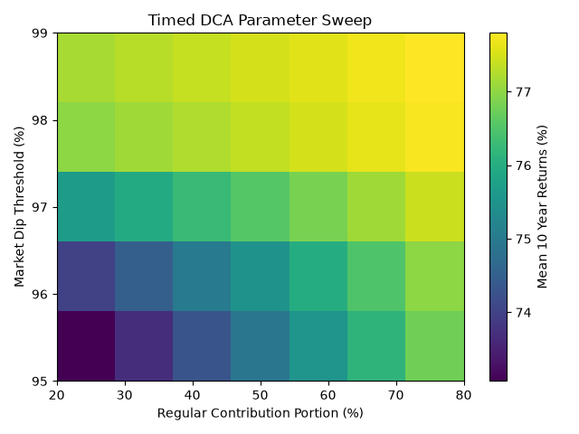
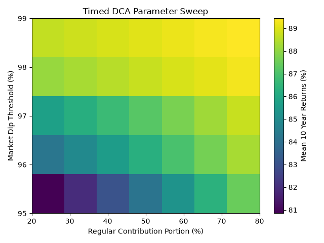

# Time in the DCA Beats Timing the DCA?

- Published: 22nd of August, 2026
- Author: Mika Novakovic

## 1. Introduction

I've built a stock index investment strategy tester in Python to test a  timing strategy stemming from an idea[^1]; **what if you do DCA (dollar cost averaging), but reserve a portion of your contributions during market highs, so that you can invest more during the drawdowns?** The answer was disappointing (as these things usually are). In this paper, I explain the details of the experiment I've conducted to evaluate this proposed strategy against common benchmark strategies, then analyze the results of said experiment. All the files required to run the experiments are shared with a MIT license in a GitHub repository[^2].

Lump sum investment is known to be statistically superior to most passive investment strategies in the long term, which was also confirmed in this paper. The proposed strategy over all ended up being a slightly worse version of the simple DCA, though it interestingly doesn't fall too far behind the DCA's performance across varying parameters.

The results essentially confirms the famous line in the world of investment, **"time in the market beats timing the market"**. The uninvested cash suffers from an opportunity cost (cash drag), which can significantly reduce the final returns of any timing based strategies. This is also the reason why the proposed strategy underperformed against DCA across every parameters tested.

## 2. Method

### 2.1. Dataset

I've used a set of two variations of the same U.S. stock index data to back test the investment strategies. Index used was the S&P 500, one of the most widely used benchmark index for the U.S. stock market, proposed and maintained by the S&P Dow Jones Indices.

The first dataset is the price only version that excludes dividends. This data was obtained from Yahoo Finance with the ticker symbol **^GSPC**, through yfinance module for Python. The prices for this dataset have been retroactively calculated to include period that predates the index itself, starting from 1927.

The second dataset is the more recent index, S&P 500 Total Return. The key difference from the price only index is that the price includes dividend reinvestment. Dividends play a huge role in real investment, so it is a more practical data for the purpose of back testing. The downside of this dataset is that it only goes back to 1988, so the dataset is much smaller compared to the price only version. The data was once again obtained from Yahoo Finance with the ticker symbol **^SP500TR**.

For both dataset, 10 year period rolling window with a stride of 1 year was used to extract the individual test samples. The first starting year was set to be 1 year after the first available year (1928 for the price only, 1989 for the total return) to avoid any incomplete years. Last starting year was set to be 2015 similarly, to ensure the full 10 year period was available across every samples. The resulting datasets contained 88 samples for the price only, and 27 samples for the total return.

### 2.2. Strategies

Three different strategies were tested, with two of them being used as the benchmark. The three strategies are **"Buy and Hold"**, **"DCA"** and **"Timed DCA"** (proposed strategy). All strategies receive the same initial budget, but the timing of investment differs.

**Buy and Hold** is a simple lump sum investment strategy. It invests the entire budget on day one, then holds it until the end of the investment period. It is not a practical benchmark, since most investors lack the funds to invest all future contributions on day one. It is used as a baseline for evaluating other strategy's performance.

**DCA** stands for dollar cost averaging. This strategy invests fixed amount of contributions until the target total contribution is achieved, often distributed across years and months. This strategy mimics what most investors do in their real investments, and is more useful as a benchmark to compare against the proposed strategy, which itself is a modified version of the DCA. For the experiment, monthly contribution version of the DCA was used.

The proposed strategy, **Timed DCA**, is similar to simple DCA, in that there's a fixed contribution each month. The difference, is that it doesn't invest all the fund available each month. Instead, it withholds portion of the fund as cash reserve, while the market is near the recent high. When the market index price falls below the recent high below a certain threshold, the entire cash reserve up to that point is invested along with the fixed monthly contribution. The aim of this strategy is to increase the final return by "buying the dip", while also cushioning the uninvested cash drag by having the steady contribution happening in the background, regardless of the market conditions.

## 3. Evaluation

With both of the datasets, all three strategies were tested for every available samples, then the statistical metrics were calculated from those the results. Metrics used are; mean final 10 year return, mean compound annual growth rate (CAGR) obtained from the mean 10 year return, minimum 10 year return, maximum 10 year return, and the standard deviation of all 10 year returns. CAGR represents annualized compounding rate of return of a compounded rate of return in a given period, calculated as following:

$$
CAGR={(r + 1)}^{\frac{1}{n}} - 1
$$

Where, $r$ is the multi-year compounded rate of return, and $n$ is the number of years.

DCA and Timed DCA both take a same parameter, number of years to spread the investments across. This parameter was set to be the first 5 years out of 10 year period for both of the strategies. Timed DCA additionally takes three parameters; portion of fixed contributions in %, threshold of market dip represented relatively from the recent high in %, and period in months to calculate the recent high. 12 months (approximation of the widely used 52 weeks) was used as the recent high reference period. For the rest of the parameters, a parameter sweep was performed with the fixed contribution portion varying from 20%-80%, and the price dip threshold varying from 95% (5% drop from high) to 99% (1% drop from high).

## 4. Results

<figure>
  
  <figption><em><b>Figure 4.1.</b> Parameter sweep heatmap of Timed DCA strategy 10 year returns. S&P 500 price only data.</em></figcaption>
</figure>

<figure>
  
  <figption><em><b>Figure 4.2.</b> Parameter sweep heatmap of Timed DCA strategy 10 year returns. S&P 500 total return data.</em></figcaption>
</figure>

**Figure 4.1.** and **Figure 4.2.** shows parameter sweep heatmaps of Timed DCA strategy tested on the two datasets. For both of the figures, the X axis represents the fixed portion of monthly contributions that are invested regardless of the market condition, and the Y axis represents the threshold for the index price dip.

**Table 4.1.** and **Table 4.2.** shows summary of the statistical metrics for the price only dataset, and the total return dataset, respectively. For the Timed DCA strategy, only the results from the best parameter combination are shown in the tables. The best parameters were 80% fixed contributions with a dip buying threshold of 99% from the 12 months high, for both of the datasets.

  <b>Table 4.1:</b> Summary of results, S&P 500 price only from year 1928 to 2025 in 10 year rolling window. The best value for each metrics are shown in bold.

| Strategy | Mean 10 Year Return | Minimum 10 Year Return | Maximum 10 Year Return | Std. Deviation | Mean CAGR |
| :--- | :---: | :---: | :---: | :---: | :---: |
| Buy and Hold | **109.77%** | -47.04% | **342.61%** | 92.36% | **7.69%** |
| DCA | 78.00% | -25.17% | 265.75% | **61.86%** | 5.94% |
| **Timed DCA** (best run) | 77.80% | **-25.08%** | 266.04% | 61.87% | 5.92% |

  <b>Table 4.2:</b> Summary of results, S&P 500 total return from year 1989 to 2025 in 10 year rolling window. The best value for each metrics are shown in bold.

| Strategy | Mean 10 Year Return | Minimum 10 Year Return | Maximum 10 Year Return | Std. Deviation | Mean CAGR |
| :--- | :---: | :---: | :---: | :---: | :---: |
| Buy and Hold | **129.51%** | -26.52% | **342.61%** | 98.91% | **8.66%** |
| DCA | 89.69% | **-21.36%** | 265.75% | **70.64%** | 6.61% |
| **Timed DCA** (best run) | 89.44% | -21.45% | 266.04% | 70.72% | 6.60% |

The best mean 10 year return for both of the datasets were achieved by the Buy and Hold strategy, as expected. The simple DCA performed slightly better than the Timed DCA in both datasets. Both the DCA and the Timed DCA achieved similarly low standard deviation compared to the Buy and Hold strategy across two datasets, but especially in the price only dataset.

Over the long period of price only S&P 500 data, Buy and Hold strategy had significantly worse minimum 10 year return compared to the other strategies. This is likely due to the fact that the price only dataset includes a period of Great Depression, where the U.S. stock market significantly underperformed.

Timed DCA strategy underperformed all strategies in almost all metrics, except for the minimum 10 year return in the price only dataset. The difference between the DCA and the Timed DCA's mean 10 year returns were less than 0.5% in both datasets. Over all, DCA and Timed DCA performed similarly across datasets in every metrics used.

## 5. Analysis

Notably, the heatmaps in both **Figure 4.1.** and **Figure 4.2.** display consistent gradient. Which shows that there are strong positive correlations between both of these swept parameters and the mean 10 year return of the strategy. Higher values for both of these parameters makes the Timed DCA behave more like the standard DCA, since it becomes less likely to store portion of monthly budget into the cash reserve. This is also evident by the fact that there are minimal differences between the performance of the Timed DCA at its highest performing set of parameters, and the DCA.

The results shows that the more the Timed DCA focuses its monthly contributions towards timing the market, the less it performs against the simple DCA. It also shows that the more it waits for the larger dip, the worse it performs. This can be explained by the fact that the S&P 500 index has a strong upwards bias in the long term. The market could keep breaking its 12 months high for many months consecutively without significant dips, in which period the Timed DCA strategy will suffer from uninvested cash drag. The DCA also suffers from the same cash drag, which is why it also underperforms the Buy and Hold strategy. This effect seems to negate any edge gained by Timed DCA buying the dips, though not by a significant margin compared to the DCA, even when the timing is set to be more aggressive.

## 6. Conclusion

There doesn't seem to be any advantages from using the Timed DCA strategy instead of the simple DCA strategy. The effect of uninvested cash drag is a significant challenge in any timed investment strategies, and the results shows that the more the strategy tries to time the dip, the more the uninvested fund suffers from the opportunity costs.

In the context of real investment, lump sum investment is almost never possible. This is because it assumes you have all the funds you'll ever invest ready on hand at the first day of investment. The most similar practical strategy is investing everything you can, the moment you can. In other words, a distributed lump sum investment. Which is more or less what the simple DCA strategy is.

The big question was, **is it possible to beat this standard strategy by introducing a rule based timing?** And the answer seems to be a disappointing **no**, at least, not by basing the timing decisions on past price movement alone.

One major caveat of this paper is that the strategies were only tested for the S&P 500 index, which only includes the stocks from U.S. market. Not all stock markets perform the same across the world; Japanese TOPIX and Nikkei 225 index had decades long period of sideways price movement for example. Although, in the century-level long term, almost all of the broad market stock indices tends to have the similar upwards bias to S&P 500, as they roughly track the economic growth of the nations they represent. The proposed strategy could possibly perform well in the long stretch of volatile and sideways moving market conditions, but even in such case, the simple DCA might still be superior.

It is also important to note that the proposed strategy has used only the past prices as the reference metric to make the timing decisions. Other timing strategies exists, often based on mean reversions, using metrics that aims to represent the underlying market conditions better, such as PER (price to earning ratio). Price only strategies tends to suffer greatly from the efficient market hypothesis, which states that the market price at any time fully reflect all available information[^3].

## References

[^1]: It was revealed to me in a dream.  
[^2]: https://github.com/big-nuggz/strategy_tester  
[^3]: [Malkiel, B. G., Fama, E. F. (1970), "EFFICIENT CAPITAL MARKETS: A REVIEW OF THEORY AND EMPIRICAL WORK", The Journal of Finance, 25, pp. 383-417](https://doi.org/10.1111/j.1540-6261.1970.tb00518.x)